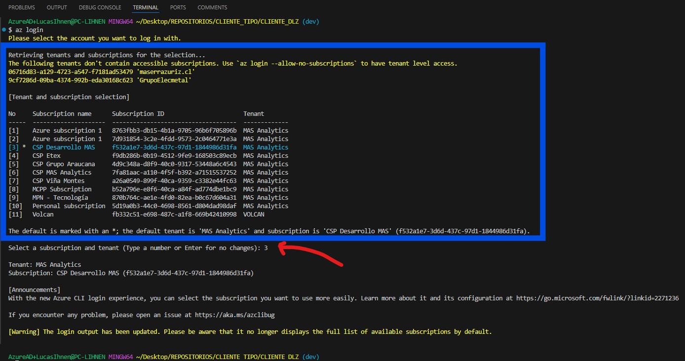

# How To Deploy Client IAC

# Deploy Client IAC

Una vez que tengas el repositorio de tu cliente, **puedes empezar a trabajar en el IAC.**

Nota: Si no tienes un repositorio del cliente para hacer el deployment de la **Data Landing Zone**, puedes ver el paso a paso de como hacerlo en: [How to Prepare IAC](infra-as-code/bicep/resources/guides/How_To_Prepare_Client_IAC.md)

## 1. Clona el repositorio de Data Landing Zone de tu cliente en tu maquina local

`Recomendación: Si trabajas en muchos clientes, te recomiendo tener una carpeta en tu escritorio que se llame “REPOSITORIOS” y una dentro que se llame “CLIENTES”.`

`Dentro de cada carpeta de cliente, vas a abrir la consola de comandos (cmd) y ahi vas clonando todos los repositorios con los que trabajes en ese cliente de manera ordenada.`

A contunación un GIF que muestra como clonar de manera local el repositorio de DLZ de tu cliente:


*Nota: El video muestra el paso a paso, hacerlo con el repositorio de tu cliente*

## 2. Abre Visual Studio, en la carpeta del repositorio

Como se comentó antes, se sugiere de sobremanera tener instalado **Visual Studio Code** para trabajar en el repositorio. Para esto, abre Visual Studio Code. Aprieta “Open Folder” y selecciona la carpeta del repositorio recién clonado.


## 3. Abre el terminal y crea una nueva rama de desarrollo

Tras haber clonado tu repositorio, se te clona el contenido de la rama “main” o “master” del repositorio del cliente. **Lo primero que haremos, es empezar a trabajar desde Git con el contenido del repositorio, siempre utilizando la buena práctica de hacer modificaciones desde una rama de desarrollo.**

Para abrir una terminal desde Visual Studio Code vas a la pestaña “Terminal”—> “New Terminal” y desde ahi puedes elegir la que mas te acomode. En mi caso, utilizo “Git Bash”.

Para clonar el contenido de la rama main, en una rama de desarrollo, llamada “dev”, se utiliza el siguiente código en el terminal:

```bash
git checkout -b "dev"
```

En el siguiente GIF puedes ver como se abre una nueva terminal, y como se crea una nueva rama de desarrollo:


Si te fijas, incluso para validar que no se esté trabajando en la rama main/master se valida haciendo un “git branch”. **La consola Git/Bash es muy util para identificar en que rama se está trabajando.**

## 4. Edita tu archivo globalParameters.json

Ahora que estas trabajando en la rama “dev”, puedes editar sin temor a que pases por encima de la rama productiva (main/master). 

El trabajo que tienes que hacer ahora, es llenar el contenido de “globalParameters.json” del repositorio:


El resumen de los parametros:

| Parametro | Tipo de Dato | Explicacion |
| --- | --- | --- |
| parNombreCompletoCliente | String | Nombre del Cliente |
| parNombreCortoCliente | String | Alguna abreviacion de utilidad para referirse al cliente |
| parLocationDeploy | String | Ubicación donde se realizarán todos los deploys, como recomendación dejar “eastus2” |
| parSubscriptionIdAnalytics | String | El id de la suscripción donde se montarán todos los recursos |
| parBudgetMensualAnalyticsUSD | Int | El valor en USD del budget mensual |
| parEnvironments: {environmentName, region} | JSON: {String, String} | Un JSON que contiene la misma estructura por cada entorno que se quiera montar. Se deben especificar tantos elementos en esta lista como entornos se quieran crear, especificando el nombre del entorno y la región donde se ubicarán los recursos en cada uno. |

*Nota: el environmentName es procesado de manera auxiliar para generar un atributo en minusculas que es “environment_lower”*

**Los servicios montados dependen directamente de estos parametros:**

- **Resource Group:** ‘GR_MASANALYTICS_[environmentName]
- **Data Factory:** 'azdf-mas-[parNombreCortoCliente]-[environment_lower]’
- **KeyVault:** 'azkv-[parNombreCortoCliente]-[environment_lower]’
- **Azure SQL:**
    - **Server:** 'azsqls-[parNombreCompletoCliente]-[environment_lower]’
    - **Database:** 'dw-[parNombreCortoCliente]-[environment_lower]’
- **Storage Account:** ‘[parNombreCortoCliente]storage[environment_lower]’
- **Synapse Analytics:** ‘azsynw-[parNombreCortoCliente]-[environment_lower]’

La arquitectura montada en un GR de Desarrollo, con el archivo globalParameters.json en sus valores genericos se ve así:


**Una vez que edites los parametros, no te olvides de guardar el archivo para el deployment!**

## 5. Loggeate en Azure CLI y hazle deploy al script!

Dentro de la misma consola que estuviste trabajando, puedes utilizar el siguiente comando:

```bash
az login
```

Este comando abrirá una ventana tipo navegador para que te loguees en la cuenta en la que harás el deployment de la suscripción. Esto, **en la mayoría de los casos, es una cuenta que provee el cliente con permisos de creación dentro de su tenant**.

Una vez iniciada sesión, te aparecerá un prompt que te preguntará en cual suscripción quieres posicionarte. **Aquí elige la suscripción con el nombre e identificador que usarás para montar los recursos, pero en el caso de que te equivoques de igual manera el script de deployment se asegurará de usar la correcta.**


Luego, simplemente eliges eliges el numero asociado a la suscripcion a usar y ya estás listo!



*En la foto: el cuadrado azul es el contenido que se te despliega luego de loggearte correctamente con “az login” y en la flecha roja es la elección de suscripción a usar para montar los recursos. Luego de apretar enter te da unos avisos y te deja en una nueva línea de comando a la espera.*

Finalmente, para deployear asegurate de tener lo siguiente:

1. Haber editado el archivo globalParameters.json de manera deseada
2. Te loggeaste con la cuenta apropiada para hacer el deployment de recursos
3. Estas parado en el directorio “root” o “raíz” del repositorio (estás parado en la carpeta de “más afuera” de todo el repositorio)

Con esto listo, ejecutas las siguientes líneas de comando, de manera secuencial y se iniciará el deployment!

```bash
chmod +x deploy_dlz.sh 
```

Nota: Si no estás parado en la ruta de más afuera (root) del repositorio, esta línea te tirará error.

Luego ejecutas el comando que inicia todo el deployment:

```bash
./deploy_dlz.sh
```

**Puedes hacerte un cafecito, que este proceso se tomará unos 15-30 minutos dependiendo de la cantidad de entornos que decidiste montar**

## 6. Éxito del deployment

El deployment se preocupa de ir montando de manera secuencial cada servicio, garantizando que el paso anterior se haya hecho de manera exitosa. 

Si todo salió de manera correcta, te debería aparecer el siguiente pantallazo


**Enhorabuena! Deployeaste toda la arquitectura de tu Data Landing Zone en tu cliente sin errores y sin tener que hacerlo tú mismo.** 

No te olvides de:

- Revisar en el [portal.azure.com](http://portal.azure.com) que salio todo como esperabas (si no, puedes eliminar los GR y volver a ejecutar el script de deploy)
- Pushear la rama dev que creaste de manera local hacia el repositorio en GitHub
