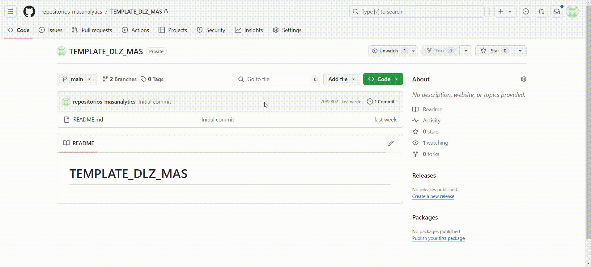
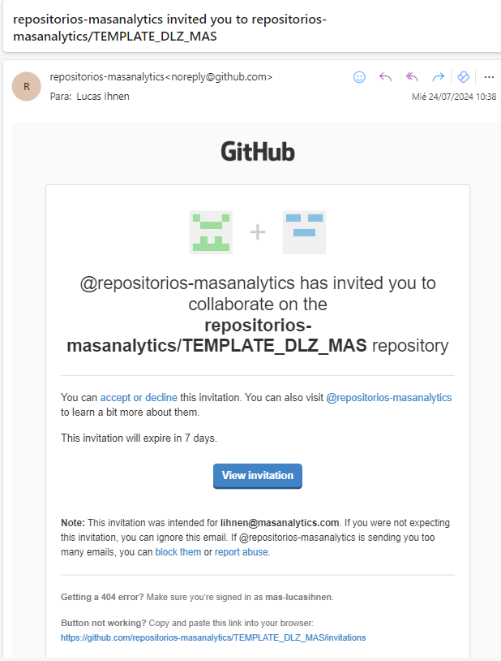
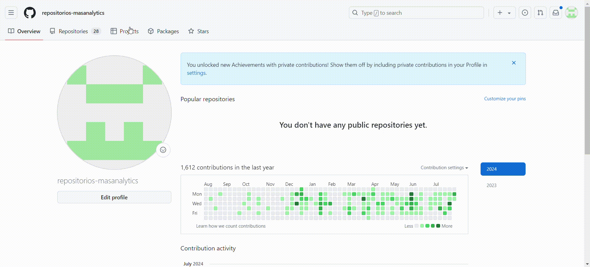

# Prepare Client IAC

## 1. Create un usuario en GitHub

Primero que nada, **el repositorio template está dentro de la cuenta de repositorios-masanalytics en GitHub**. Para poder acceder a él, se debe solicitar permisos de colaborador a la cuenta de GitHub de masanalytics de cada uno. 

En el caso de no tener creado una cuenta en GitHub personal de MAS Analytics, haz click en [este enlace](https://github.com/signup?ref_cta=Sign+up&ref_loc=header+logged+out&ref_page=%2F&source=header-home) y sigue las instrucciones.

**Recomendación**: Seguir la siguiente convención de nombres para la cuenta de GitHub de MAS Analytics:

- correo: [tu_usuario_mas]@masanalytics.com
- usuario: [tu_usuario_mas]-masanalytics
- contraseña: algo que sea seguro y recordable por tí.

**Ejemplo:**

- correo: lihnen@masanalytics.com
- usuario: lihnen-masanalytics
- contraseña: C0l3ga!

## 2. Accede a repositorios-masanalytics

Dentro de repositorios-masanalytics tienes que encontrar el repositorio llamado “[TEMPLATE_DLZ_MAS](https://github.com/repositorios-masanalytics/TEMPLATE_DLZ_MAS)”

### 2.1. Comparte el template a tu cuenta creada

Lo primero que debes hacer, **es invitar como colaborador del repositorio TEMPLATE_DLZ a tu cuenta de GitHub recién creada.**


*Nota:Ignorar que mi cuenta ya estaba invitada al repositorio*

Con esto, a tu cuenta de correo te debería haber llegado una invitación como esta:



Acepta la invitación, y **ya eres colaborador del repositorio!**

### 2.2. Crea un repositorio para el cliente en el que trabajarás:

El template es sólo eso, un template, para poder trabajar en un cliente específico, se debe crear un nuevo repositorio dentro de la cuenta de repositorios-masanalytics que se encargará de la Infraestructura como Código (IaC) dentro de Azure.

Para esto, puedes ver el siguiente .gif:



Nota: Lo importante es lo siguiente:

1. Seguir la nomenclatura **[CLIENTE]_DLZ para nombrar el repositorio**
2. Que el repositorio quede **PRIVADO**
3. **NO incluir un README file**, esto se creará en pasos siguientes

**NOTA: De manera representativa, se está creando un repositorio llamado CLIENTE_DLZ, en la práctica esto tendrá el nombre del cliente en cuestión.** 

### 2.3. Comparte el repositorio de DLZ del cliente a tu cuenta

Este paso ya lo hicimos en el paso 2.1. para el repositorio del template, simplemente hay que repetir los pasos, pero para el repositorio recien creado.

### 2.4. Clona el repositorio template en tu máquina local

Para hacer esto, usaremos la terminal.

Antes de ejecutar cualquier comando, garantiza que cumples con lo siguiente:

1. Tu cuenta GitHub tiene acceso de colaborador al repositorio TEMPLATE_DLZ_MAS
2. Tu cuenta GitHub tiene acceso de colaborador al repositorio recién creado del cliente
3. Tienes abierta [la página del repositorio template](https://github.com/repositorios-masanalytics/TEMPLATE_DLZ_MAS).

Con esto validado, **clonaremos el repositorio template en alguna ruta local en tu computador**. 

Para efectos demostrativos, crearemos una carpeta en el escritorio que se llame “REPOSITORIOS”. No le des tanta vuelta al nombre, será un paso necesario intermedio.

Ve este GIF para revisar el proceso completo de clonar el repositorio de manera local:


Lo importante aquí es:

1. Obtener la URL del repositorio desde la página en GitHub
2. Crear una carpeta para almacenar el contenido del repositorio en tu máquina local (carpeta en el escritorio llamada “REPOSITORIOS”)
3. **TRUCO:** Si se tiene abierta la carpeta en el explorador de archivos y se escribe “cmd” (como se ve en el gif), entonces te abre la consola de comandos en esa ruta. Muy útil.
4. Escribir el comando “git clone “ y apretar Ctrl+V para pegar la URL del paso 1.
5. Apretar ENTER y esperar
6. Validar que se haya creado carpetas en la ruta especificada!

### 2.5. Clona el repositorio local hacia el repositorio del cliente

Para esto necesitarás la misma URL que obtuviste del TEMPLATE, pero esta vez del repositorio del cliente.

Si hiciste todo con la misma nomenclatura, la URL debería ser:

[https://github.com/repositorios-masanalytics/CLIENTE_DLZ](https://github.com/repositorios-masanalytics/CLIENTE_DLZ)

Siendo necesario cambiar el “CLIENTE_DLZ” por el nombre del repositorio del cliente. Guardala para más rato, ya que está URL la usaremos para crear una línea de comando en un par de pasos más.

Los pasos que tienes que seguir son: (Al final un GIF demostrativo)

1. Vuelve a abrir la consola de comando desde el explorador de archivos
2. Escribe “cd TEMPLATE_DLZ_MAS” y aprieta enter:

```bash
cd TEMPLATE_DLZ_MAS
```

1. Ejecuta la siguiente línea de comando (puedes copiar y pegar):

```bash
git remote remove origin
```

1. La URL que guardamos, la ejecutarás desde el siguiente comando:

***Nota: Valida que estés apuntando correctamente al repositorio del cliente***

```bash
git remote add origin [https://github.com/repositorios-masanalytics/CLIENTE_DLZ](https://github.com/repositorios-masanalytics/CLIENTE_DLZ)
```

1. Finalmente ejecutas la siguiente línea de comando:

```bash
git push -u origin main
```

Si todo sale bien, deberías pasar de que el repositorio del cliente sea vacío a un repositorio con toda la información del template en la nube de GitHub!

A continuación, un GIF que muestra el proceso completo:


**Ahora ya tienes el repositorio para tu cliente listo para usar y deployear el script!!**

Solamente te queda seguir los pasos de [Deploy Client IAC](How_To_Deploy_Client_IAC.md)

Y estarás listo!!
