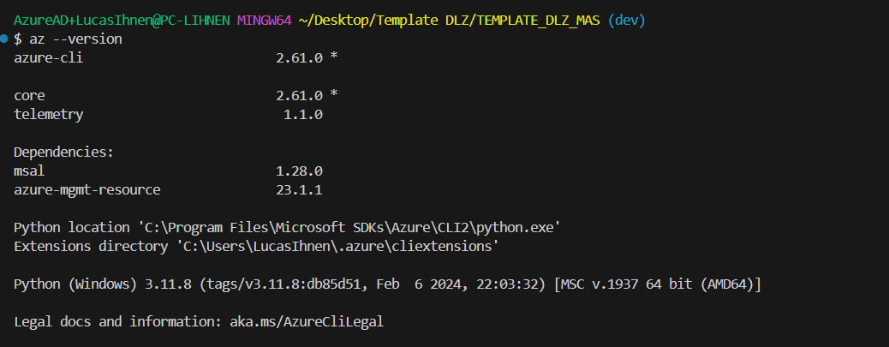

# Setup BICEP

Para poder usar este repositorio y desplegar los servicios de la Data Landing Zone, **se hace uso del lenguaje BICEP de Microsoft para deployear recursos dentro de un ecosistema Azure**. 

Esta guía busca ser el paso a paso para que cualquiera pueda hacer uso de este *template* y poder instalar todos los componentes necesarios para su correcto funcionamiento.

## 1. Azure CLI:

**Azure CLI es la interfaz de lineas de comando (CLI) principal para deployear** todos los *template files* creados de este repositorio. Para descargarlo [haz click aquí](https://learn.microsoft.com/en-us/azure/azure-resource-manager/bicep/install#azure-cli) e instala para el sistema operativo que estés usando.

Para validar que está correctamente instalado el CLI de Azure, se puede ejecutar en el terminal:

```bash
az --version
```

Y se debería obtener una respuesta como esta:



*Nota: En caso de que entregue error la primera vez, probar cerrando y abriendo la consola/terminal y probar nuevamente.*

## 2. Visual Studio Code:

Si bien, no es estrictamente necesario, **es altamente recomendado utilizar VS Code**, considerando que tiene fuerte sinergia con el lenguaje Bicep a través de una extensión específica. 

Para instalar Visual Studio Code [aprieta este enlace](https://code.visualstudio.com/download) y sigue las instrucciones en pantalla.

### 2.1. BICEP Extension

Dentro de VS Code existe una extensión muy útil para poder trabajar con archivos con extensión “.bicep”. Para usarla debes buscar la palabra “bicep” e instalar la que se ve así:


## 3. JQLang

Dentro de los archivos necesarios para orquestar y ordenar el repositorio y los templates, existe una libreria necesaria para poder trabajar en la consola bash con archivos JSON. 

Para instalar JQLang, ejecuta la siguiente línea de código en la consola de tu computador (ojalá haciendo click derecho “Ejecutar como Administrador”):

```bash
winget install jqlang.jq
```

Para validar si es que se instaló correctamente, se puede ejecutar la siguiente línea de código:

```bash
jq --version
```

Esto debería entregar una respuesta como la siguiente:


*Nota: En caso de que entregue error la primera vez, probar cerrando y abriendo la consola/terminal que se usó para instalar y probar nuevamente.*